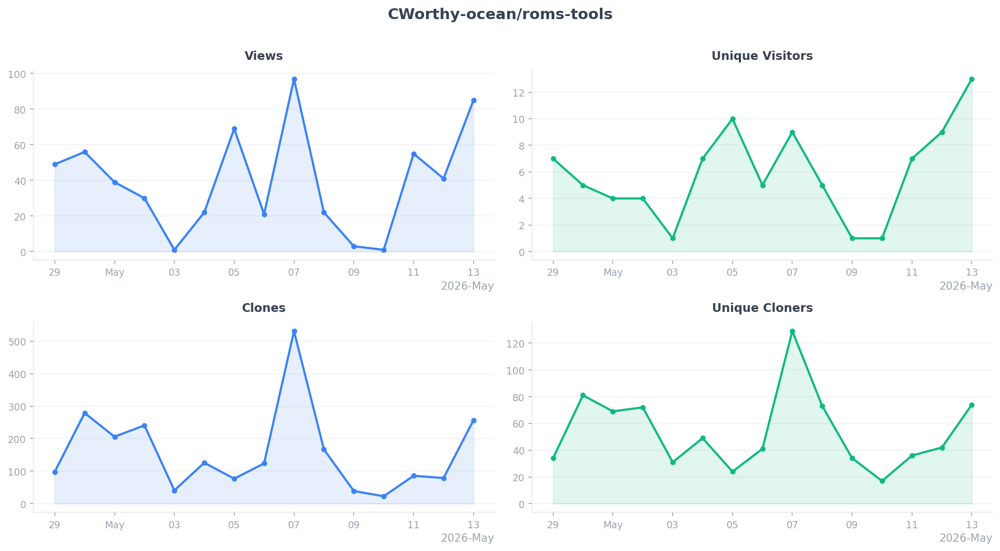
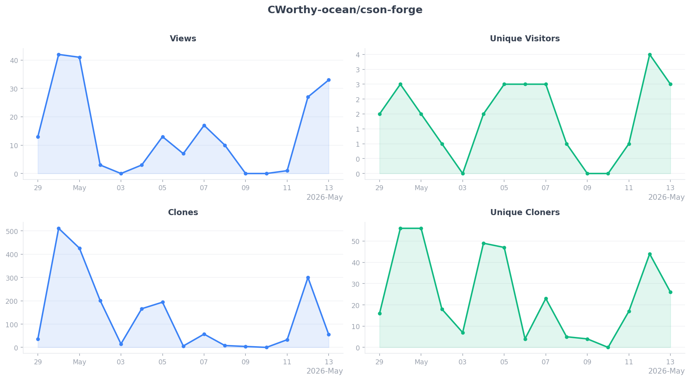
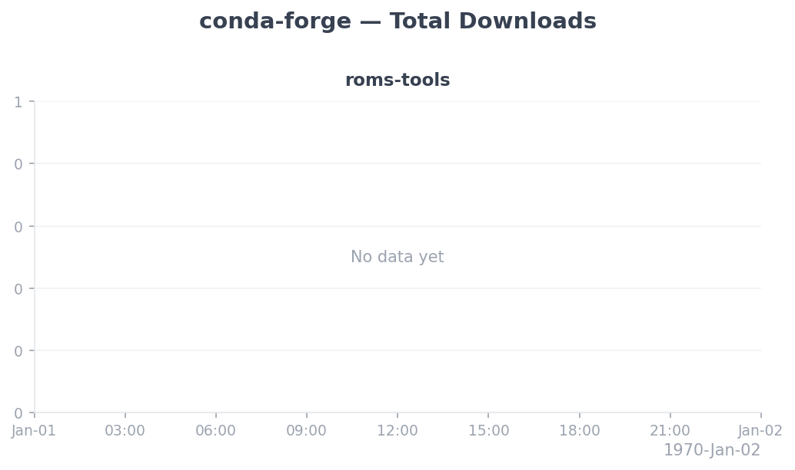

# GitHub Metrics

Automated daily collection of traffic and engagement data for
[C]Worthy GitHub repositories and conda-forge packages.
Data is fetched via the GitHub and Anaconda APIs and stored as CSV files
under [`data/`](data/). Plots are regenerated each time new data is collected.

---
## GitHub Traffic

### [CWorthy-ocean/C-Star](https://github.com/CWorthy-ocean/C-Star)

### [CWorthy-ocean/roms-tools](https://github.com/CWorthy-ocean/roms-tools)

### [CWorthy-ocean/cson-forge](https://github.com/CWorthy-ocean/cson-forge)

## Conda Downloads

