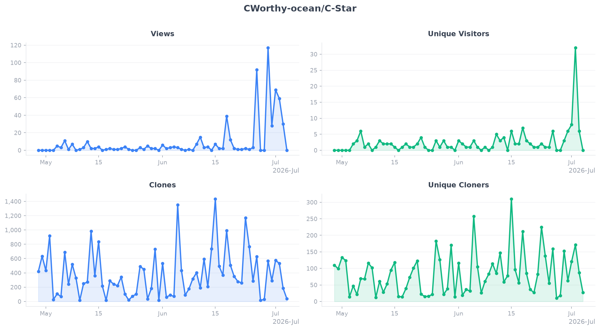

# GitHub Metrics

Automated daily collection of traffic and engagement data for
[C]Worthy GitHub repositories.  Data is fetched via the GitHub API
and stored as CSV files under [`data/`](data/).  Plots are regenerated
each time new data is collected.

---
## [CWorthy-ocean/C-Star](https://github.com/CWorthy-ocean/C-Star)

